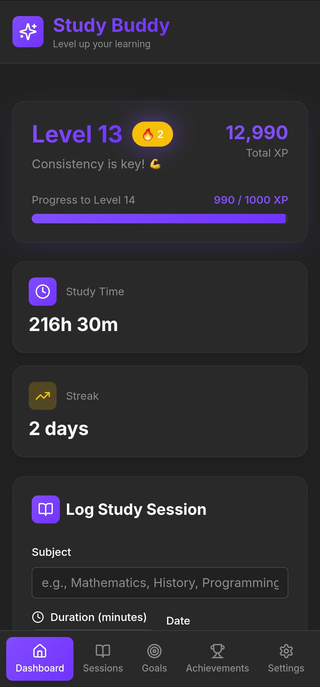
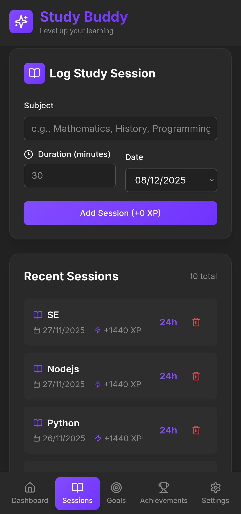
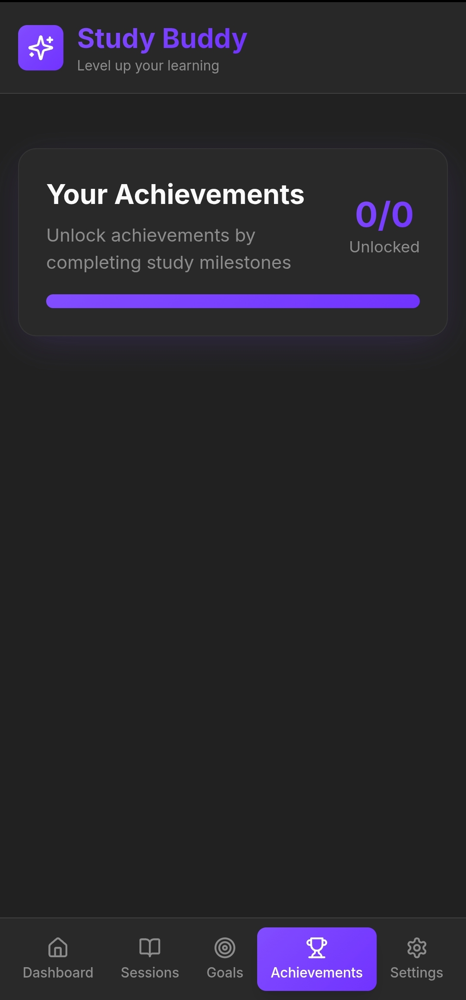
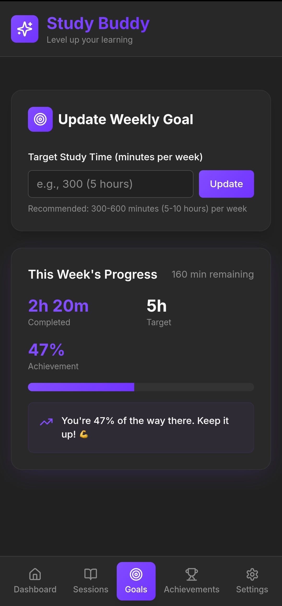
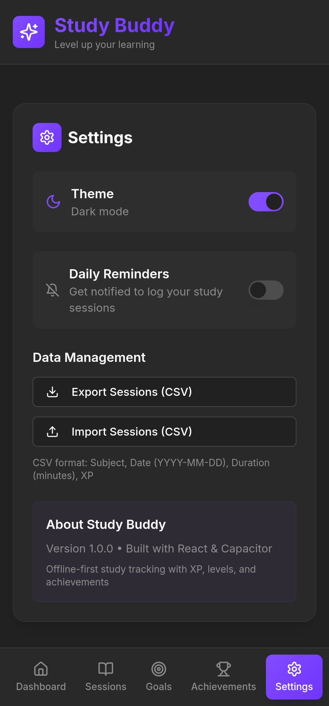

# 📊 StudyLens — Study Behavior Analytics System

> *Most study apps just track time. This one analyzes behavior.*

A data-driven, gamified study tracking app that transforms raw session logs into behavioral insights — consistency scores, subject patterns, streaks, and XP progression — to make disciplined studying actually rewarding.

[](https://studybehavioranalyticssystem.netlify.app)
[](LICENSE)
[](https://react.dev)
[](https://studybehavioranalyticssystem.netlify.app)

---

## ✨ Key Features

| Feature | Description |
|---|---|
| 📝 **Session Logging** | Log subject, duration, and date with persistent localStorage |
| 📈 **Behavioral Analytics** | Consistency score, frequency trends, subject distribution, most active day |
| 🏆 **Achievement Engine** | Rule-based unlocking across XP milestones, streaks, session count, long sessions, subject specialization |
| ⚡ **Gamification Layer** | XP progression, level system, streak tracking, progress visualization |
| 📊 **Data Visualization** | Bar charts (subject vs time), line charts (progress over time), real-time dashboard |
| 🐍 **Python Extension** | Offline deeper analysis via `analytics_dashboard.py` using Pandas |

---

## 📸 Screenshots

<p align="center">
  
  
</p>
<p align="center"><em>Home Screen &nbsp;&nbsp;|&nbsp;&nbsp; Session Screen</em></p>

<p align="center">
  
  
</p>
<p align="center"><em>Achievement Screen &nbsp;&nbsp;|&nbsp;&nbsp; Goal Screen</em></p>

<p align="center">
  
</p>
<p align="center"><em>Settings Screen</em></p>

---

## ⚙️ How It Works

```
User logs session → Stored in localStorage → Metrics computed dynamically
→ Achievement conditions evaluated → Insights rendered via charts & summaries
```

**Example insights generated:**
- Study consistency percentage over time
- Subject dominance patterns
- Daily activity trends
- Performance growth curve

---

## 🛠️ Tech Stack

| Layer | Technology |
|---|---|
| Framework | React + TypeScript |
| Visualization | Recharts |
| State Management | Custom React Hooks |
| Storage | localStorage (offline-first) |
| Styling | Tailwind CSS |
| Deployment | Netlify |
| Analytics Extension | Python + Pandas |

---

## 📂 Project Structure

```
src/
├── components/       # UI components
├── hooks/            # Core logic (sessions, stats, achievements)
├── pages/            # Main views
├── utils/            # Helper functions
└── types/            # TypeScript type definitions
```

---

## 🔮 Future Improvements

- Timestamp-based analysis (hour-level insights)
- Cloud sync via Supabase
- Predictive analytics and study recommendations
- Multi-user support

---

## 🧩 Key Takeaways

- Designed a modular achievement engine with dynamic multi-condition rule evaluation
- Implemented a behavioral analytics pipeline on real-time session data
- Combined data insights with gamification loops to reinforce consistent study habits

---

## 📄 License

Licensed under the [MIT License](LICENSE).

---

## 👤 Author

**Vara Prasad K** — Aspiring Data Analyst | Python · React · TypeScript

[](mailto:kavalivaraprasad16@gmail.com)
[](https://www.linkedin.com/in/vara-prasad-k-4a6026230/)
[](https://github.com/prasadk1628)
